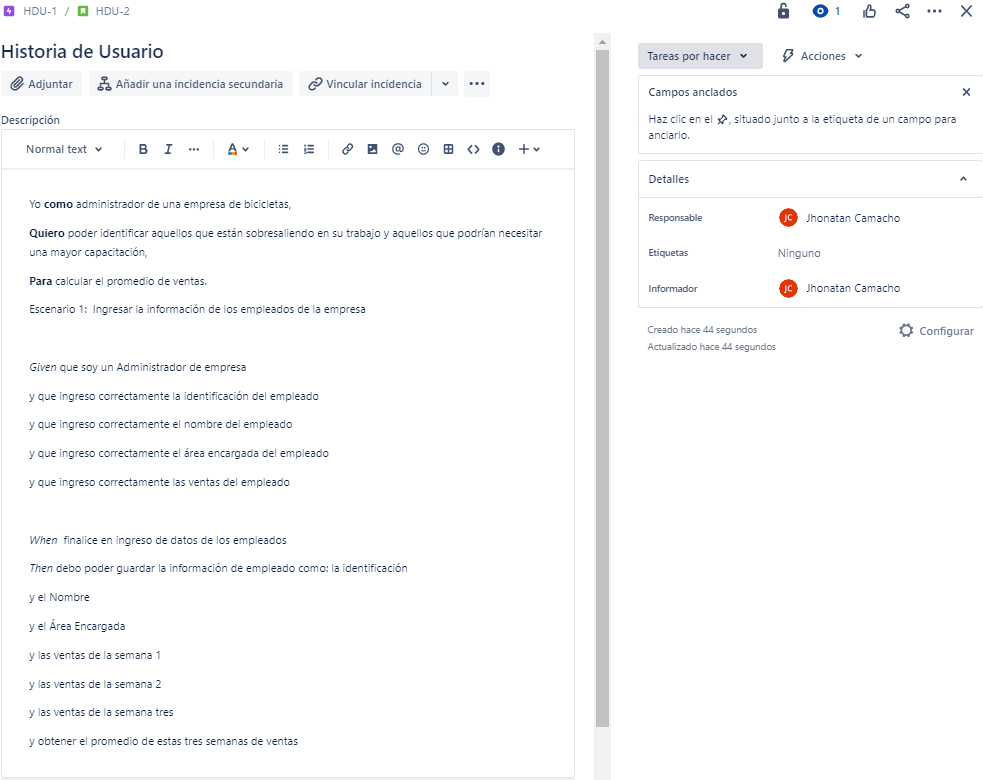
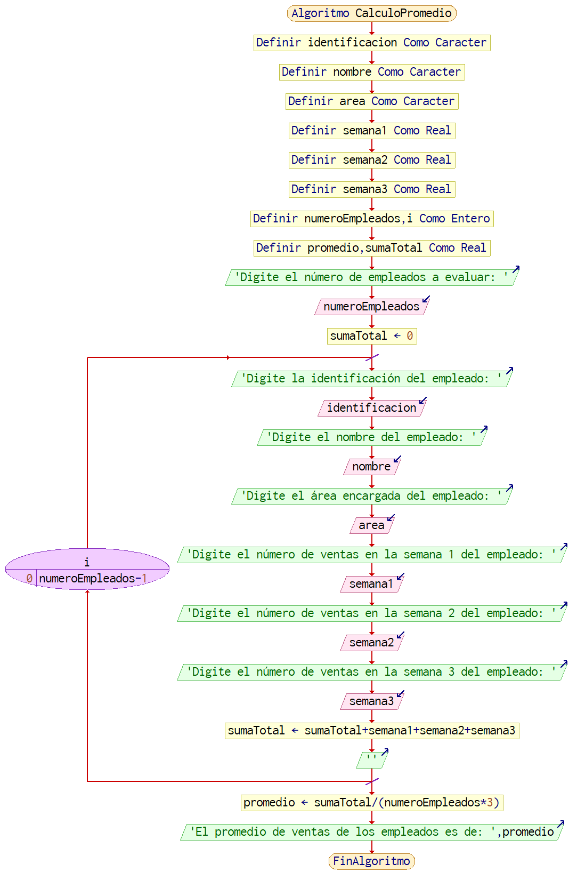

# EJERCICIO BASE 

En su labor como programador de software ha sido elegido para el desarrollo de una aplicación que necesita un Administrador de una empresa, que desea calcular el promedio de 3 (tres) ventas de un empleado en un periodo determinado. Este empresa evalúa a los empleados y calcula el promedio general. Como información básica de cada empleado se debe registrar el número de identificación, su nombre y el area encargada.

Aclaraciones:

    • Se supondrá que la aplicación solo se requiere para calcular el promedio de un único periodo especifico.

    • Para efectos de mantener la simplicidad del ejemplo no se contemplan manejar persistencia en el almacenamiento de los datos.

    • No se realiza validación, ni se verifica calidad en los datos ingresados.

# HISTORIA DE USUARIO 
 
# CASO DE USO  
 

Descripcion caso de uso:

    Nombre: Calcular Promedio Ventas Empleados 

    Actores: Administrador de empresas

    Propósito: Guardar identificación, nombre, area encargada y tres ventas del empleado en un periodo de tres semanas para calcular su promedio.

    Curso normal de eventos: 

    1. El Administrador ingresa la cantidad de empleados.

    2. El Adminitrador ingresa la identificación, nombre, area encargada, ventas en semana 1, ventas en semana 2 y las ventas en semana 3 del empleado.

    3. Se calcula el promedio a partir de:
    ( ∑(semana 1, semana 2, semana 3) / Total Ventas) / Cantidad Empleados

    4. Se Muestra el promedio de los Estudiantes del Curso

    Postcondiciones: Promedio de Notas Calculado

# DIAGRAMA DE FLUJO  
 

Entender el anterior diagrama no debe presentar mayores problemas. Sin embargo, es conveniente realizar las siguientes
aclaraciones y comentarios:

    • Aunque se puede condensar el código incluyendo las instrucciones del segundo “Para” dentro del primero, de manera intencional se ha dejado así intencionalmente para delimitar funcionalmente cada bloque de código.

    • En el algoritmo se captura información, como la identificación, el nombre y el area encargada, que no se utiliza; sin embargo, esta información se mantiene porque posteriormente puede ser útil para ampliar la funcionalidad de la aplicación.
    Inicialmente el algoritmo no contempla validaciones como impedir el doble ingreso de un mismo número de identificación.

# SEUDOCOGIGO  
    Algoritmo CalculoPromedio
    Definir identificacion Como Cadena
    Definir nombre Como Cadena
    Definir area Como Cadena
    Definir semana1 Como Real
    Definir semana2 Como Real
    Definir semana3 Como Real
	
    Definir numeroEmpleados, i Como Entero
    Definir promedio, sumaTotal Como Real
	
    Escribir "Digite el número de empleados a evaluar: "
    Leer numeroEmpleados
	
    sumaTotal <- 0
	
    Para i <- 0 Hasta numeroEmpleados-1 Con Paso 1 Hacer
        Escribir "Digite la identificación del empleado: "
        Leer identificacion
		
        Escribir "Digite el nombre del empleado: "
        Leer nombre
		
        Escribir "Digite el área encargada del empleado: "
        Leer area
		
        Escribir "Digite el número de ventas en la semana 1 del empleado: "
        Leer semana1
		
        Escribir "Digite el número de ventas en la semana 2 del empleado: "
        Leer semana2
		
        Escribir "Digite el número de ventas en la semana 3 del empleado: "
        Leer semana3
		
        sumaTotal <- sumaTotal + semana1 + semana2 + semana3
		
        Escribir ""

    FinPara
	
    promedio <- sumaTotal / (numeroEmpleados * 3)
	
    Escribir "El promedio de ventas de los empleados es de: ", promedio
    FinAlgoritmo

